# Views

This week we’ll be looking at the basic building blocks of a UI - the views.  Android has hundreds of different Views and today we’ll be talking about some of the most commonly used, how to style them, and how to link and use them in our code.

[View documentation](https://developer.android.com/reference/android/view/View)

## `TextView`

Let’s take our TextView from last time. We’ll talk about the three most common attributes you’ll set - text, text size, and text color

We filled out the android:text field last time.  We can set the text in XML by providing a string (or, preferably, a string resource) as the value.  This works if we always know what the text will be in that TextView, but often we’ll have more dynamic text, like if we wanted to display a news article from the network.  In this case, we can programatically set the text by using the `setText` method. This is an overloaded method that can take a few options. We’ll only concern ourselves with two of those for now.  One takes a CharSequence (for our purposes, a String) and the other takes a string resource integer (`R.string.<variable_name>`).

Text size can be set with the `android:textSize` attribute.  While this attribute allows us to set the size in pixels or dp, text size should be set in **sp**.  Programatically, we can use one of two versions of `setTextSize` to set this text - one method we specify the type (px, dp, sp) and provide the size in that value, and one method we pass only the size (where it is assumed to be sp).

Lastly, we’ll look at setting the text color.  This can be done in XML by passing a color resource (`@color/color_name`) or by setting an (A)RGB color value. Best practice in XML is to supply a color resource.  We can also set the text color programmatically with `setTextColor`, but we can’t just pass the R.color.color_name integer - instead we’ll need to wrap it with `ContextCompat.getColor(context, R.color.<color_name>)` and pass that to `setTextColor`.

We can see how we'd set all three of these attributes both in XML (on the left) and programmatically (on the right) in the image below

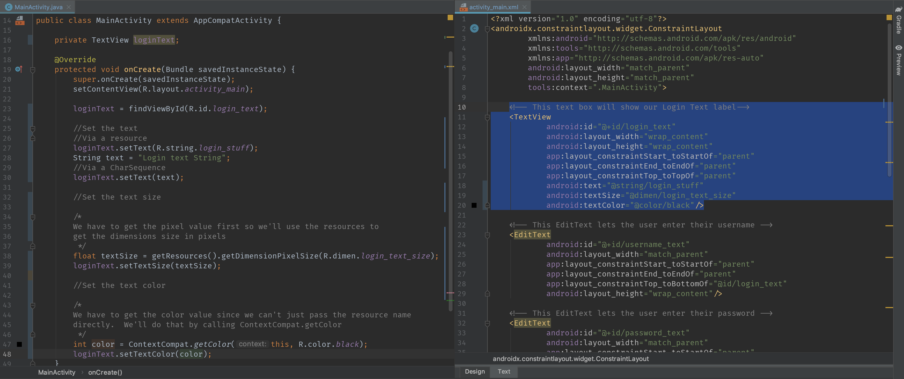

## `EditText`

An EditText is basically text entry - it allows the user to enter text and for you to grab that text.  EditText is a subclass of TextView so you have all the attributes and methods fromTextView available, plus a few more. There are three new attributes we’re concerned with for EditText: `android:inputType`, `android:imeOptions`, and `android:hint`.  These attributes are actually in the TextView class, but we’ll see them used in EditText primarily.

The inputType attribute is a list of constants that allow you to specify the type of data being entered (such as text or maybe just numbers) and what help to provide the user (like autocorrecting or offering autocorrect options).  This can change what type of keyboard comes up (full keyboard vs numpad).

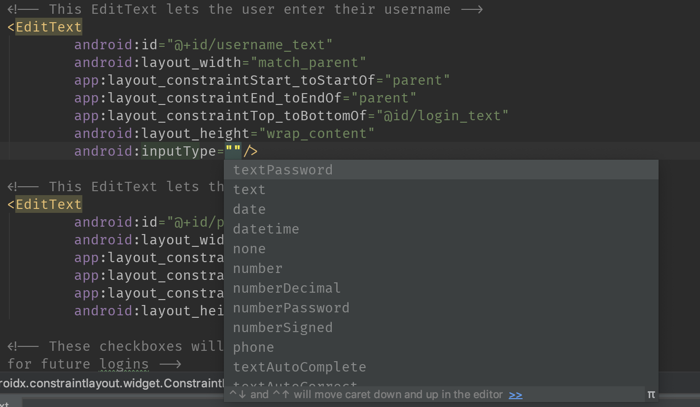

Our second attribute, imeOptions, can be used to control your input method editor (what IME stands for), primarily for controlling what your “action” button does.  This is also from a list of constants and can be used for things like taking the user to the next field that accepts input (actionNext) or send the message once finished (actionSend).

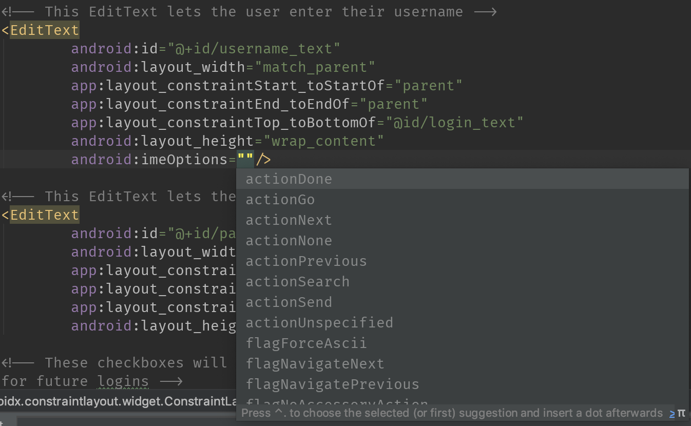

The hint attribute is used to provide a hint to users as to what to enter into the EditText - you’ll give it some sort of string (like “Enter Password” for a password field)

A hint added via XML:

will look like this in Design:

In code, we can get the text from an EditText by calling editText.getText().toString() (as getText() doesn’t return a string, we need to make it one).

If we want to do any kind of input validation (maybe this username needs to be at least 8 characters long and contain no special characters), we can add something called a TextWatcher by calling `editText.addTextWatcher(TextWatcher watcher)`.  TextWatcher has 3 methods - `beforeTextChanged`, `onTextChanged`, and `afterTextChanged`. For some types of input validation, we’ll usually do that in onTextChanged

We can see both of these in the image below
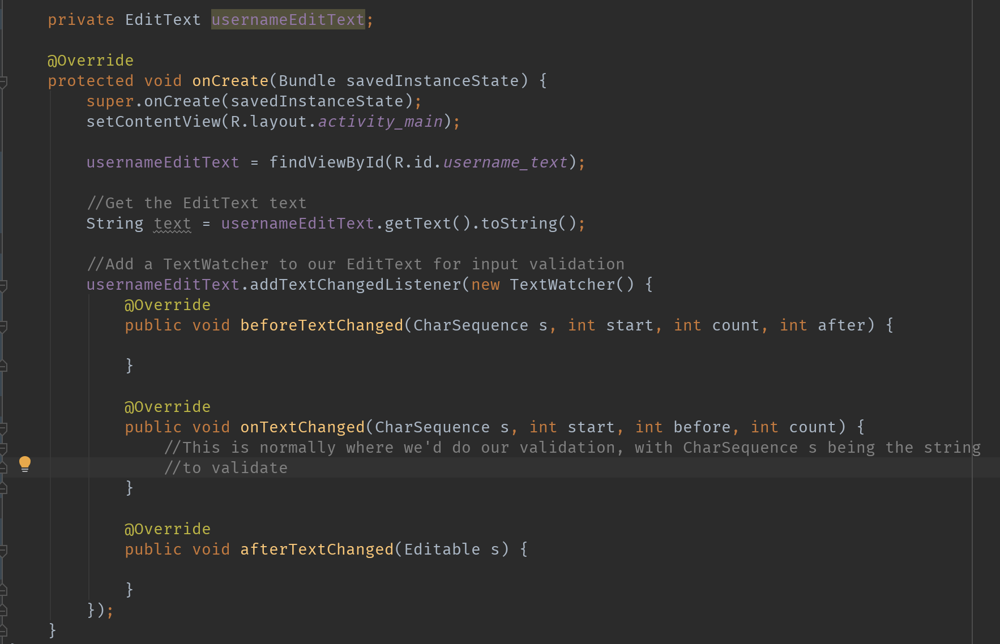

## `TextInputLayout`

Normal EditTexts aren’t really used as much in production apps.  Instead, what we’ll do is use something called a TextInputLayout.  This is basically a wrapper around an EditText (or TextInputEditText which is just a subclassed EditText designed to be used in a TextInputLayout) that adds a lot of styling and new features. 

Instead of setting the hint on the EditText, we’ll set it on the TextInputLayout.  If we add some text to the EditText, we can see how that hint now becomes a floating label

We can add a character counter to the TextInputLayout by setting the `app:counterEnabled=”true”`.  If we want to limit the number of characters, we can set `app:counterMaxLength=”<integer value>”`.  If the user exceeds the max count, the layout will turn red to indicate an error.

We can also display some sort of error underneath the TextInputLayout line.  By default this is disabled, but we can enable it by setting `app:errorEnabled=”true”`.  If we set this, we can see how the TextInputLayout gets bigger because of the space where the error would go. We can set this error in code with the method `textInputLayout.setError(CharSequence error)`

Lastly, for passwords we can add some functionality for allowing the password to be toggled visible.  For this to work, we have to make sure to set the EditText’s android:inputType to be some type of password input. The toggle is disabled by default, so we need to enable it with `app:passwordToggleEnabled=”true”`.  This will get us the default eye icon, but we can specify our own icon with `app:passwordToggleDrawable=”@drawable/drawable_name”`

Here's how we'd set these things in XML - note the counter attributes in the Username input (the first one) and passwordToggleEnabled in the Password input.  We also had to set `inputType="textPassword"` on the EditText inside the Password TextInputLayout.

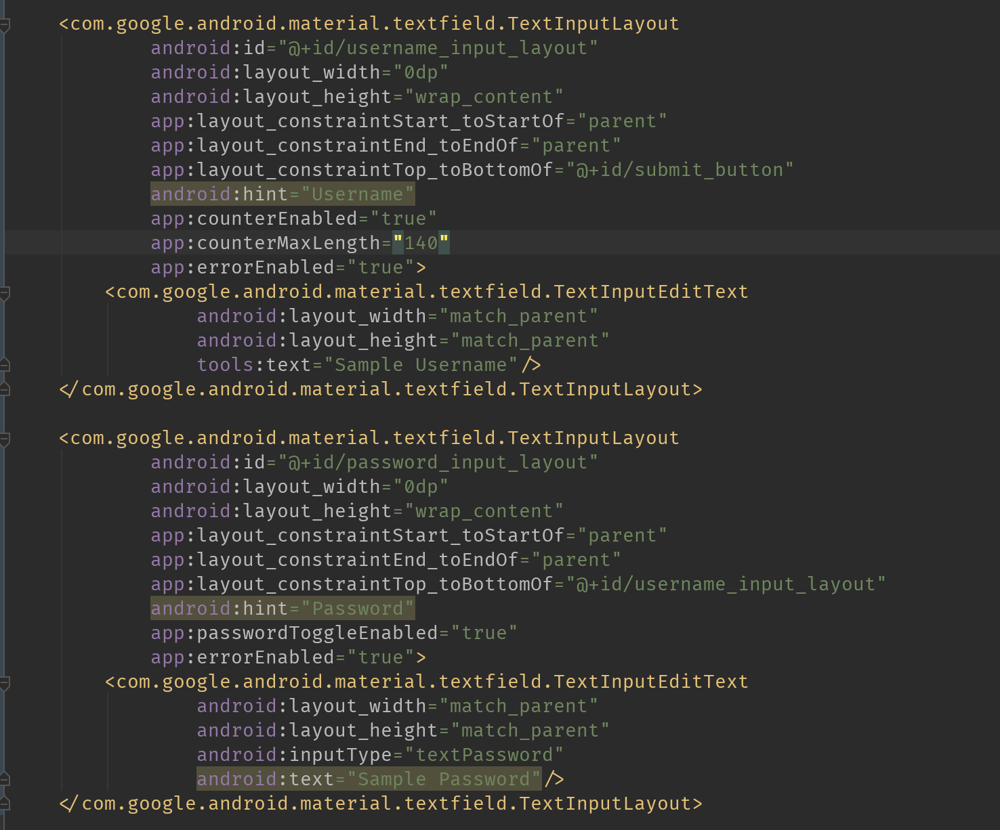

And here's how they look in the Design view:
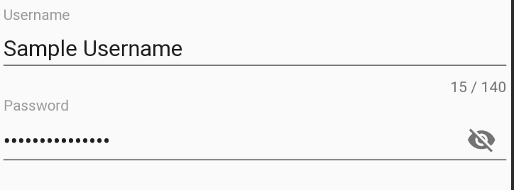

And here's how the default error looks (the message was supplied by me via `setError("Invalid Username")`):

## `Button`

Buttons in Android are actually just, yet again, a subclass of TextView, so we have all the same methods available to us (text, textColor, textSize).  In the XML there’s really not much different.

The biggest thing with buttons is how to handle clicks.  There is an attribute on buttons that you can set in XML, `android:onClick=”methodName”` that will work as long as there’s a method defined with that name (and that method takes a View for an argument).  This isn’t done often and I’d suggest setting your button’s onClick programmatically rather than in XML.

To set a button’s click listener programmatically, we call `button.setOnClickListener(View.OnClickListener listener)`.  This listener only has one method - `onClick(View view)` where the view parameter is the view that was clicked.  In that onClick method is where we’d handle any logic and take any actions that need to be taken after somebody presses the button.

A quick note: there’s another button, MaterialButton, that behaves mostly the same as a normal Button but has some added functionality (like if you want the corners to be rounded or have an outline around the button). 

Button in XML:

And how you set a listener in code:
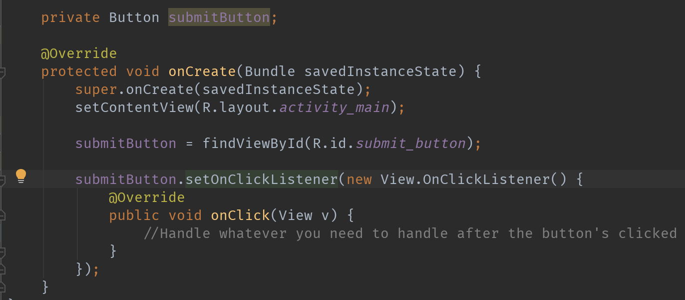

## `RadioButton` and `RadioGroup`

In instances where you might need to present a list of options and have users choose one, we have RadioGroup and RadioButtons.  A RadioGroup is a LinearLayout specifically for RadioButtons.  Being a LinearLayout, we can set the orientation for the buttons to be laid out (horizontal or vertical), and we can also specify a default checked button by setting `android:checkedButton=”@id/checked_button_id”`. 

Inside the RadioGroup we’ll add RadioButton widgets.  These are subclasses of something called CompoundButton (which is itself a subclass of Button) that allows for a checked/unchecked state.

Here's how we'd lay out the RadioGroup and RadioButtons in XML (notice that `radio_button_second` is marked as the checked button)

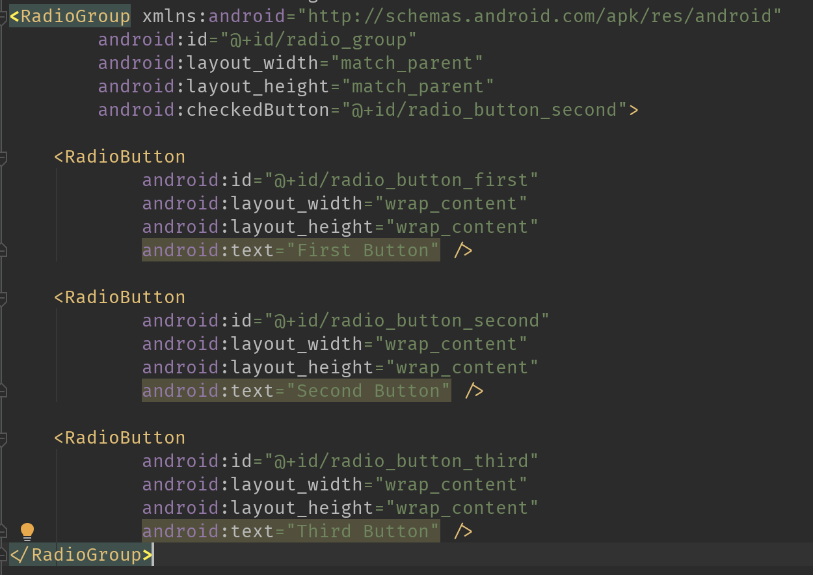

And here's how it displays:

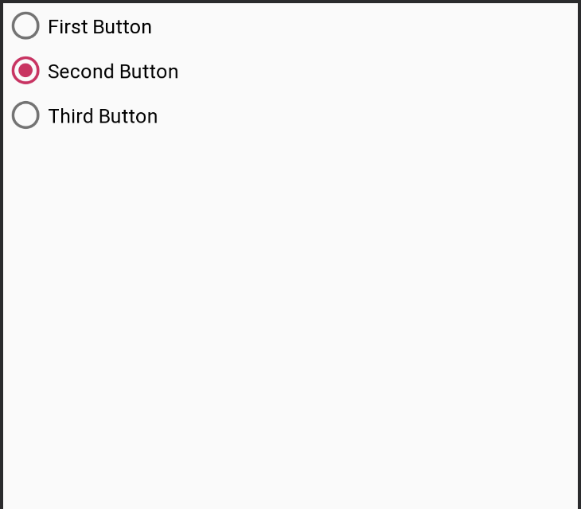

We can handle changes in RadioButtons being checked in one of two ways:

First, we can add the same click listener to each RadioButton and figure out which RadioButton was clicked by checking the clicked view’s ID.

Our second, more preferable way is to attach a `RadioGroup.OnCheckedChangeListener` on the RadioGroup.  We can do this programmatically by calling `radioGroup.setOnCheckedChangeListener(RadioGroup.OnCheckedChangeListener listener)`.  The listener only has one method, onCheckedChanged, that has the RadioGroup where the change happened and the ID of the button that is now checked.

Here we'll add one of those listeners to a RadioGroup and see how we'd handle all the different buttons inside:

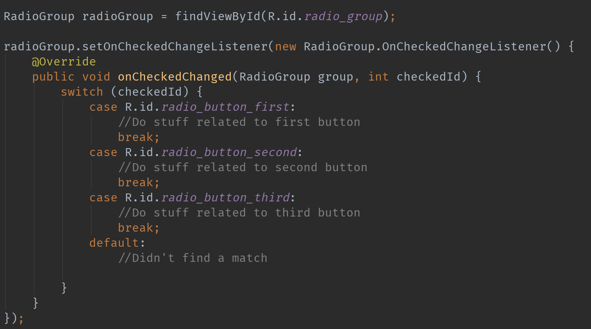

## `Switch` and `CheckBox`

A switch is basically just an on/off button with only those two states (on/off).  It extends from CompoundButton, same as RadioButton, so the `android:checked` attribute controls whether it’s off (checked = false) or on (checked = true). The nub there is known as a thumb, and you can actually provide a custom thumb using the attribute `android:thumb=”@drawable//drawable_name”`.  Being a CompoundButton, we can also set `android:checked=”true”` if we want the Switch to be on by default.

In code, if you want to find out whether the Switch is on or off, you can call `switch.isChecked()`.

There are two other attributes, `android:textOn` and `android:textOff` that we can pass strings to and it will display text based on the state of the Switch.  Note that this text will be displayed over the Thumb - not the text that can be set otherwise.

A similar view worth mentioning is the Checkbox.  There’s really not much to say since this one is very similar functionally to a RadioButton or Switch.  It’s another child of CompoundButton so you can do all the same stuff, and find out whether the Checkbox is checked in code by calling `checkBox.isChecked()`.

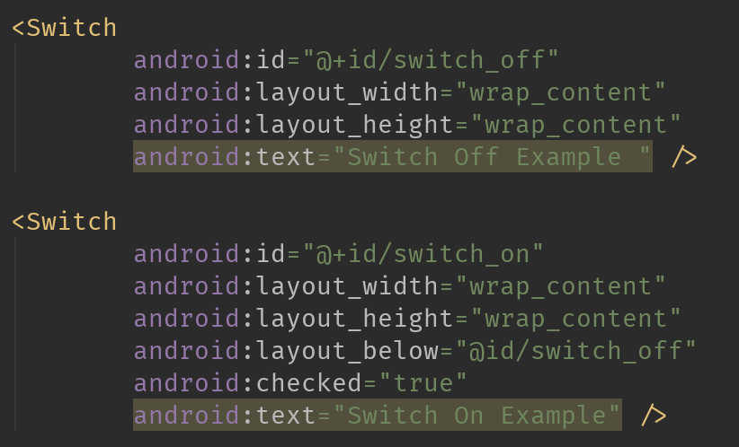

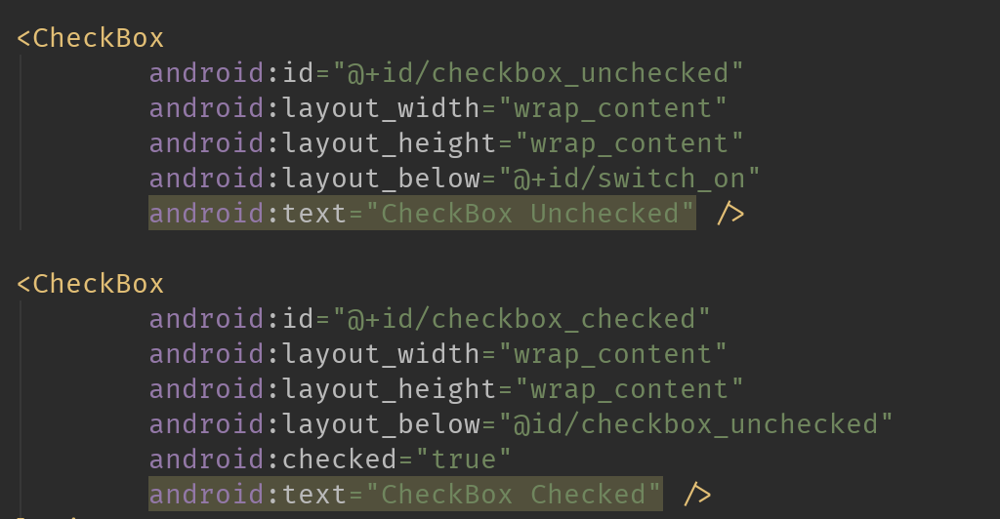

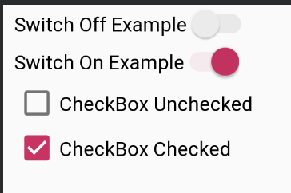

## `ImageView`

Lastly, we’ll talk about the ImageView.  As its name implies, it’s used primarily to show an image (a Drawable or Bitmap).  There are about 10 attributes unique to ImageView, but we’re only gonna concern ourselves with two of the most common: `src` and `scaleType`.

The src attribute is almost always a Drawable reference (@drawable/drawable_name), though it can also be a color reference.

The scaleType attribute tells the ImageView how it might need to change the image to fit within the ImageView’s height and width.  This is a defined list of constants that you guys can read up on, but has stuff like center to center the image (but don’t scale it), or centerCrop to scale/crop the image and also maintain its aspect ratio.

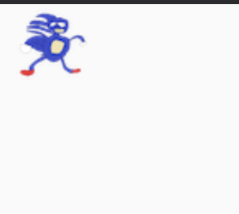